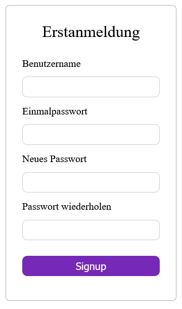
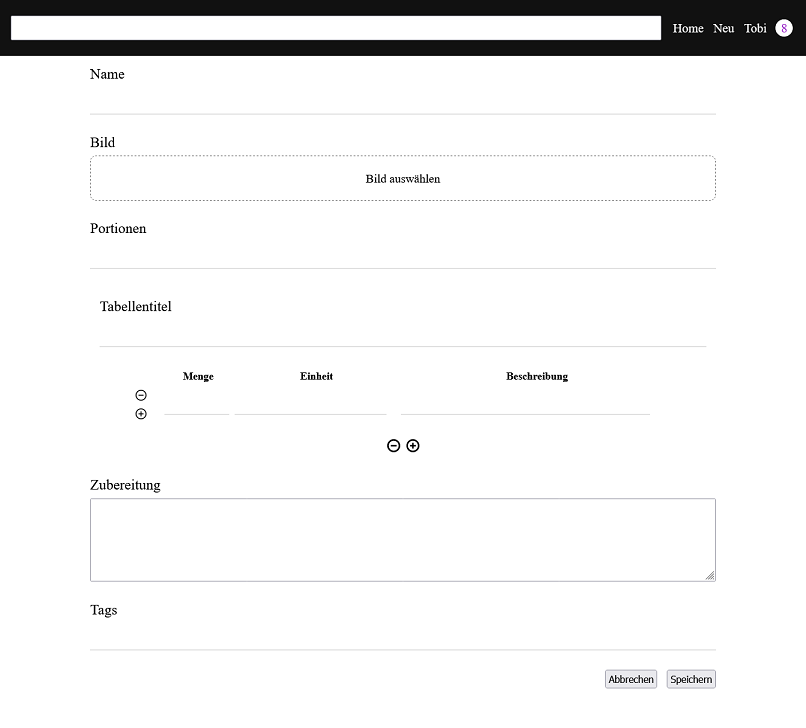
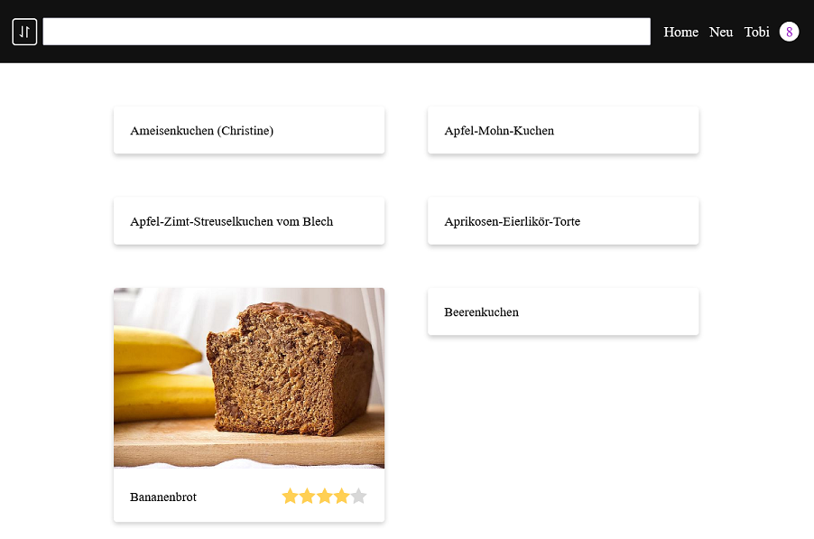
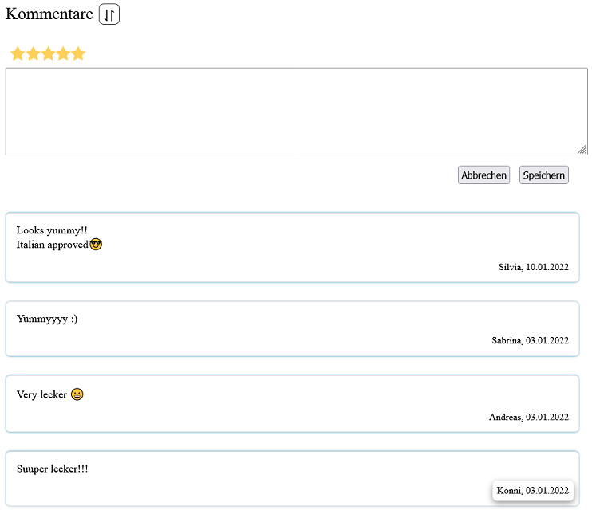

# Kooking Konni

A web-based cookbook for friends and family.
This fullstack Flask application lets you share and engage with recipes on your private, invitation-only website.
It's styled for desktops, tablets, and mobile.
## Features

### Privacy

Users can only be registered by the administrator.
Only registered users can access the website beyond the login page.
This creates a comfortable environment without the worry of strangers peering into private matters
while retaining the full flexibility of a website.

### Post / Edit Recipes

Users can post new recipes with all the necessary information including
a title, an image, the number of servings, ingredients, instructions, and defining tags.
Additionally, users can edit the recipes they authored.

### Browse Recipes

The search bar lets users browse recipe dynamically.
Recipes are only displayed if their automatic keywords contain any words from the query.
Are you trying to find a recipe that covers your left-over ingredients?
Can you not quite put your finger on the exact title of your friend's latest creation?
Just search for their names instead!

### Rate / Comment Recipes

You can rate and comment any recipes.
Only the average rating of a recipe is displayed for everyone.
Your own rating of a recipe stays concealed.
However, comments can be seen by anyone. The comment section is ideal to discuss recipes with the author or leave tips for other users.

## Setup

Python (Flask, Click), SQLite, Javascript (Fetch API), HTML5, and CSS were used to create this website.
The setup is heavily influenced by [Flask's tutorials](https://flask.palletsprojects.com/en/2.0.x/tutorial/deploy/).
This project implements the [application factory design pattern](https://flask.palletsprojects.com/en/2.0.x/patterns/appfactories/).

### CLI Administration

Kooking Konni offers some administrative tools over its [CLI](https://flask.palletsprojects.com/en/2.0.x/cli/):

1. ``export FLASK_APP="kkonni"``
2. ``flask <command>``

| Command             | Function                                                   |
|---------------------|------------------------------------------------------------|
| ``create-database`` | Initialize a new database for the application              |
| ``create-user``     | Create new user with a username and a single-use password  |
| ``delete-user``     | Remove a user and their content from the application       |
| ``reset-password``  | Reset a user's password by assigning a single-use password |
| ``change-username`` | Change the name of a user                                  |

### Deploy to PythonAnywhere

Create a new project and upload the `kkonni` module to your files.
You may include an existing database or create a new one with ``flask create-database``
and then start adding users with ``flask create-user``.

Add the line ``app = create_app()`` to ``kkonni.__init__.py``.
Open up the ``wsgi`` file and include the line ``from __init__ import app as application``.

## Future

* Better styling!

* Show number of ratings, show ratings in half-steps (currently average full-steps)

* More sophisticated search mechanism (currently only inclusive)

* Custom sorting of results and comments (currently only oldest/newest first)

* User profiles, notifications, tagging in comments (currently none)

* Support different database technologies (currently only sqlite) 

* Support multiple languages (currently only German)

* Append row on enter if in last cell

* Custom input form errors

* Add Favicon _everywhere_ (currently only `/favicon.ico`)

## Changelog

### v0.2.0

* Fixed language
* Ingredients Table:
  * Added option to leave cells blank
  * Added option to insert rows anywhere
  * Now supports multiple ingredients tables
